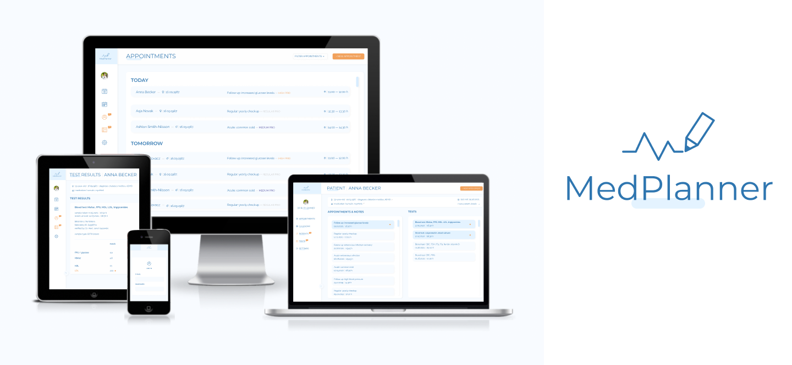

# MedPlanner - web app for private and public health doctors (work in progress)
MedPlanner is a web app for private and public health doctors to manage patient profiles, lab test results and appointments.

## Main Technologies

1. HTML
1. CSS
1. SASS
1. JavaScript
1. Node.js
1. Express
1. EJS
1. JSON/BSON
1. MongoDB
1. Mongoose
1. Git

## Main Tools

1. VSC
1. Figma